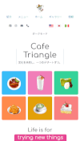

# CafeRefresh

Live Site: [CafeTriangle](https://cafe-triangle.com)

This is complete refactor for Cafe Triangle website. Cafe Triangle is a small cafe located in Ishikawa, Japan. This site provides information about Cafe Triangle, including its pastries, drinks, food options, and location. It also expands upon the last site by adding new functionality, new styles, new layout, and other important Angular optimizing features. This site was created by one of the cafe Owners, Juan Lagunas.

## Features

- **Responsive Design:** The website is fully responsive, with layouts optimized for screens ranging from mobile (320px) to 4K (2560px).
- **Dark Mode:** Users can toggle between light and dark modes for a customizable viewing experience.
- **Multilingual Support:** The website supports English, Japanese, and Spanish languages, implemented using ngx-translate.
- **Angular Page Transitions:** Smooth and visually appealing page transitions enhance the user experience.
- **Performance Optimizations:** The website uses Angular's @defer directive for efficient loading, and images are lazy-loaded and resized to optimize performance.
- **Accessibility Features:** The website is built with semantic HTML, includes alt attributes for all images, and follows other best practices for web accessibility.
- **Google Maps Integration:** A link to Google Maps provides users with easy access to the cafe's location.
- **Custom UI Components:** The website features custom UI components for a unique and engaging user interface.
- **Flowbite Components:** Flowbite components are used to build responsive grid layouts.
- **Menu Item Filtering:** Users can filter menu items for a more streamlined browsing experience.
- **Lighthouse Audits:** Regular Lighthouse audits ensure the website maintains high performance, accessibility, and SEO standards.
- **Angular Dynamic Interpolation:** Dynamic interpolation capabilities in Angular are used to efficiently update and display data.

## Screenshots

### Desktop

  
  

## Technologies Used

- Angular CLI version 17.3.0: The core framework for building the single page application.
- TypeScript: Used for static typing and enhancing JavaScript code.
- HTML 5: Markup language for creating the structure of web pages.
- Tailwind CSS ^3.4.1: A utility-first CSS framework for rapid UI development.
- SCSS: CSS preprocessor for more maintainable stylesheets.
- ngx-translate ^15.0.0: Internationalization library for Angular.
- flowbite ^2.3.0: Utility classes for building responsive grid layouts.

## Installation and Setup Instructions

Clone down this repository. You will need `node` and `npm` installed globally on your machine.

- Installation: `npm install`
- To Start Server: `ng serve`
- To Visit App: `localhost:4200`

## Contributing

While this project is primarily a personal, educational project, input and suggestions are welcome. If you have feedback, please open an issue in this repository.

## License

This project is licensed under the terms of the MIT License. See the [LICENSE](LICENSE) file for details.
